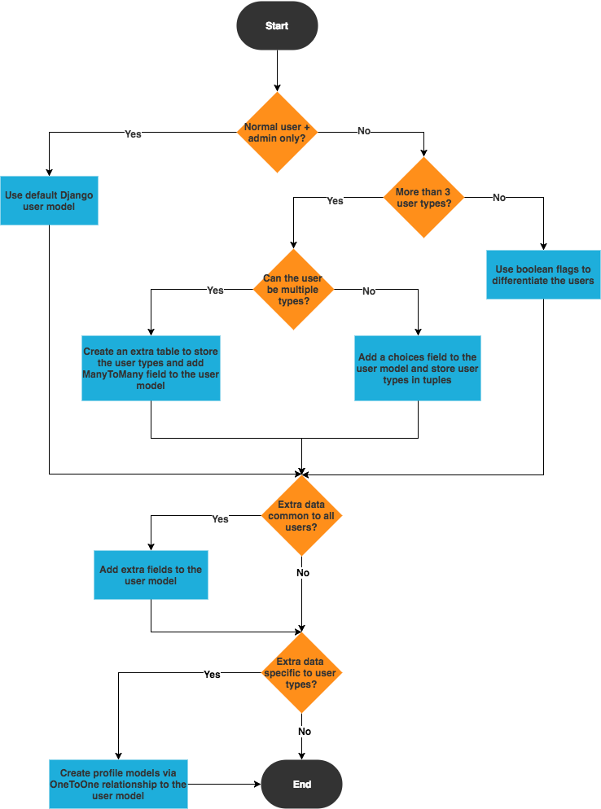

# Test task

## Solution algorithm
- Create AbstractBaseUser and inherit from it Employee and Client
- Create and customize UserCreationForm
- Create model **Task** with fields: 
```
Status ->  Ожидает исполнителя, В процессе, Выполнена. 
Client -> ForeignKey
Employee -> ForeignKey
Date of creation
Date of update
Date of closing(if set cannot modify)
Report
```
- Create permission for client to create **Task** and view **Task**
- Create authorization based on tokens(access and refresh tokens)


Endpoints = [

    /token -> Get token

    /user/id -> User information

    /task/id/(create, edit, read, close)  -> Working with task(cannot delete created task)

    /employee/(create, read) - Work with employee

    /client/(create, read)- Work with client


]




Need to run `migrate` and `migrate --run-syncdb`